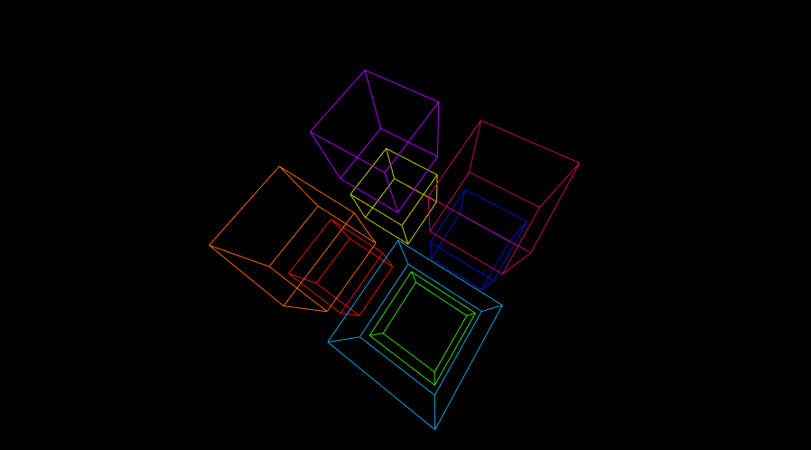
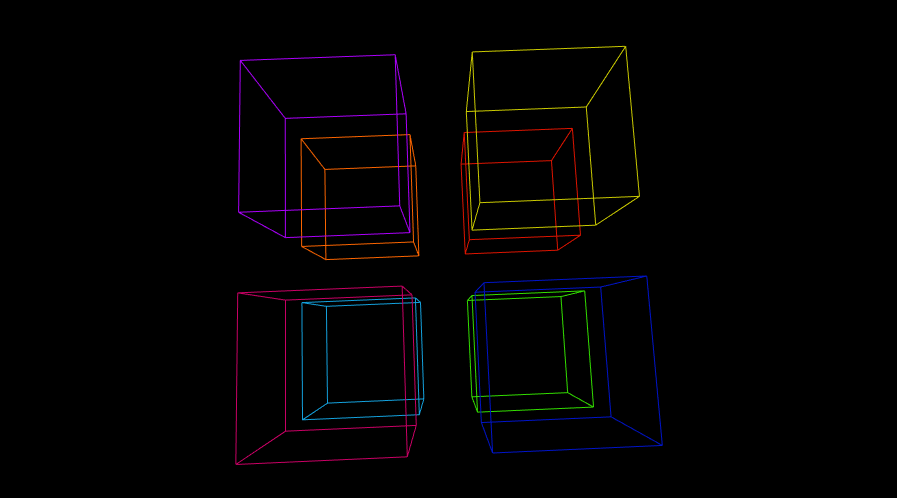
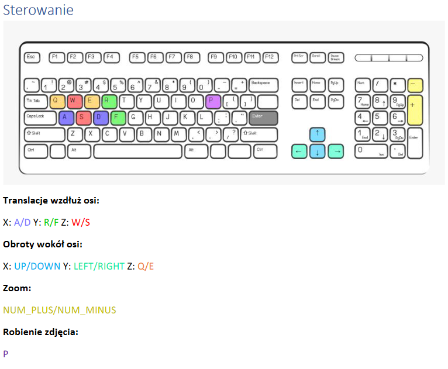

# VirtualCamera

Projekt wirtualnej kamery wykonany jako jedno z zadań na przedmiocie Grafika Komputerowa.

Przedstawiony na scenie obiekt składa się z ośmiu różnokolorowych sześcianów.

Kamera posiada również możliwość przybliżania i oddalania widoku poprzez zmianę wartości ogniskowej.

